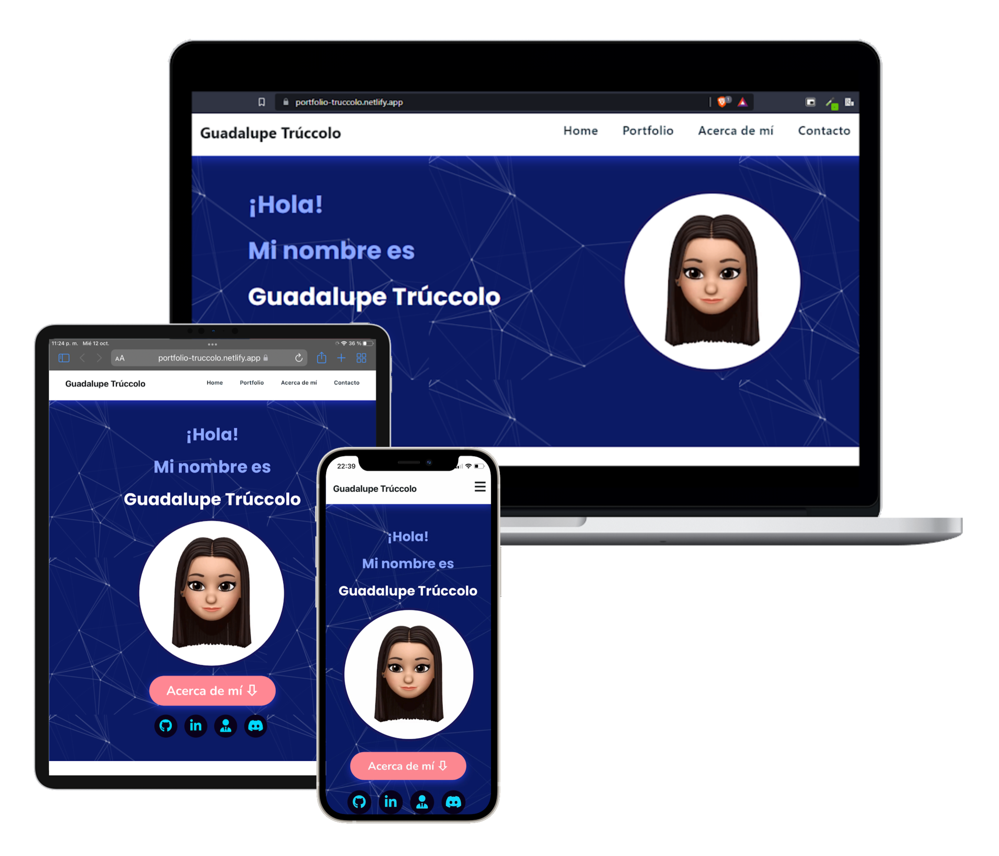

<h2 align="center">
  Portfolio Website
   
  <a href="https://portfolio-truccolo.netlify.app/" target="_blank">Portfolio | Trúccolo</a>
</h2>

  

 

 &nbsp;
 &nbsp;
 &nbsp;
 &nbsp;

## Built With

This project was built using these technologies.

- HTML5
- CSS3
- VsCode
- Netlify
- Bootstrap

## Features

**📱 Responsive Design**
